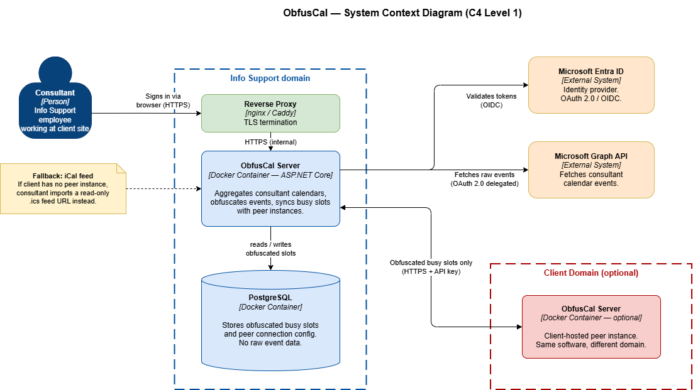

# 3. Context & Scope

## System Context

ObfusCal operates within a federated model. Each participating organisation runs its own independent instance. Instances
exchange only obfuscated availability data through a documented REST API. No raw calendar data ever crosses a domain
boundary.

## External Interfaces

| External System                    | Direction        | Protocol                                   | Purpose                                                                                                   |
|------------------------------------|------------------|--------------------------------------------|-----------------------------------------------------------------------------------------------------------|
| Microsoft 365 / Exchange Online    | Inbound (read)   | MS Graph API over HTTPS (OAuth 2.0)        | Fetch raw calendar events for a registered user                                                           |
| Exchange On-Premise *(deprecated)* | Inbound (read)   | Exchange Web Services (SOAP/HTTPS)         | Fetch raw calendar events in legacy environments (library selected in ADR 0005; adapter won't be shipped) |
| Google Workspace                   | Inbound (read)   | Google Calendar API over HTTPS (OAuth 2.0) | Fetch raw calendar events                                                                                 |
| iCal Feed (`.ics` URL)             | Inbound (read)   | HTTP GET                                   | Fallback ingestion for restrictive client environments                                                    |
| Peer ObfusCal Instance             | Bidirectional    | REST over HTTPS (`X-Peer-Id` validation)   | Exchange obfuscated busy slots between domain instances                                                   |
| Entra ID (Azure AD)                | Inbound (auth)   | OpenID Connect                             | Authenticate human users (calendar owners and sysadmins)                                                  |
| User's Calendar (write-back)       | Outbound (write) | MS Graph / CalDAV                          | Write obfuscated shadow slots back into the user's connected calendar                                     |

## Scope Boundaries

**In scope:**

- Calendar ingestion, obfuscation, and storage
- Cross-domain busy slot exchange with peer instances
- iCal fallback for non-participating client domains
- User authentication via Entra ID SSO
- Sysadmin trust management and peer connection approval
- Booking link generation (stretch goal)

**Out of scope:**

- Consumer calendar platforms as primary targets (the system is designed for enterprise B2B use)
- Email integration or meeting invitation forwarding
- Real-time push notifications (polling on a configurable interval is the sync model)
- Mobile applications
