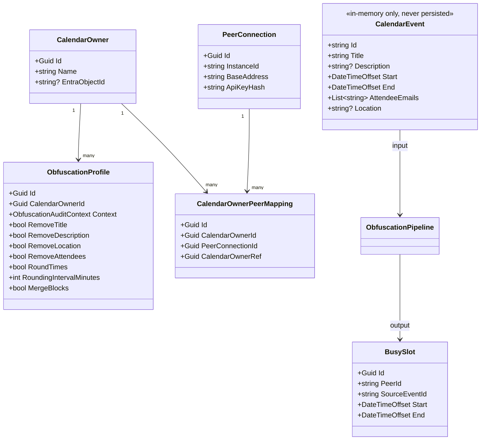

# 5. Building Block View

## Level 1: Solution Projects

The solution follows Clean Architecture. Dependencies point strictly inward.

```
ObfusCal.Api  ──────────────────►  ObfusCal.Application  ──►  ObfusCal.Domain
                                            ▲
ObfusCal.Infrastructure  ─────────────────►┘
                         also references ──────────────────►  ObfusCal.Domain
```

`ObfusCal.Domain` has zero external NuGet dependencies. `ObfusCal.Infrastructure` implements interfaces defined in
`ObfusCal.Application`. `ObfusCal.Api` and `ObfusCal.Infrastructure` are wired together exclusively in `Program.cs`.

## Level 2: Key Components

### ObfusCal.Domain

| Component                      | Responsibility                                                                 |
|--------------------------------|--------------------------------------------------------------------------------|
| `CalendarEvent`                | In-memory record for a raw event fetched from a calendar source. Never stored. |
| `BusySlot`                     | Obfuscated record with start and end only. The only calendar data ever stored. |
| `IObfuscationTransformer`      | Contract for a single event-level obfuscation step in the pipeline.            |
| `IBusySlotTransformer`         | Contract for a slot-level post-processing step (e.g. merging).                 |
| `RemoveTitleTransformer`       | Clears the event title.                                                        |
| `RemoveDescriptionTransformer` | Clears the event description.                                                  |
| `RemoveLocationTransformer`    | Clears the event location.                                                     |
| `RemoveAttendeesTransformer`   | Removes all attendee email addresses.                                          |
| `RoundTimesTransformer`        | Rounds start down and end up to the nearest 15 minutes.                        |
| `MergeBlocksTransformer`       | Collapses overlapping or adjacent slots into single continuous blocks.         |

### ObfusCal.Application

| Component                       | Responsibility                                                                                            |
|---------------------------------|-----------------------------------------------------------------------------------------------------------|
| `ICalendarSource`               | Contract all calendar adapters must implement.                                                            |
| `IShadowSlotStore`              | Contract for storing busy slots received from peer instances.                                             |
| `ICalendarOwnerScopeResolver`   | Looks up a `CalendarOwner` record by Entra ID Object ID.                                                  |
| `ICalendarOwnerObfuscationProfileService` | Reads/updates per-owner, per-context obfuscation settings.                                     |
| `ObfuscationPipeline`           | Chains transformers; converts `CalendarEvent` list → `BusySlot` list. Emits structured audit log per run. |
| `ObfuscationAuditContext`       | Enum: `Internal` (own view) vs `Client` (peer-facing view).                                               |
| `ObfuscationProfileSettings`    | Effective transformer toggles and rounding interval for a context.                                         |
| `GetBusySlotsQueryHandler`      | Fetches and obfuscates events for a calendar owner (Client context).                                      |
| `GetMergedFreeBusyQueryHandler` | Merges own obfuscated slots with received shadow slots (Internal context).                                |
| `PushShadowSlotsCommandHandler` | Stores inbound obfuscated slots from a peer in the shadow slot store.                                     |
| `SyncOptions`                   | Configuration model for sync interval, look-ahead window, and local peer identity credentials.            |

### ObfusCal.Infrastructure

| Component                          | Responsibility                                                                                          |
|------------------------------------|---------------------------------------------------------------------------------------------------------|
| `MockCalendarSource`               | Development adapter returning hardcoded events anchored to today.                                       |
| `GraphCalendarSource`              | Production adapter fetching events via Microsoft Graph (loaded as plugin).                              |
| `ICalFeedCalendarSource`           | Fallback adapter parsing a read-only `.ics` URL (loaded as plugin).                                     |
| `InMemoryShadowSlotStore`          | Thread-safe in-memory store; used in tests and as the fallback if the DB is unavailable.                |
| `EfCoreShadowSlotStore`            | PostgreSQL-backed store via EF Core; production implementation.                                         |
| `AppDbContext`                     | EF Core context; holds `CalendarOwner`, `PeerConnection`, `CalendarOwnerPeerMapping`, `BusySlot`.       |
| `EfCoreCalendarOwnerScopeResolver` | Looks up `CalendarOwner` by `EntraObjectId`.                                                            |
| `CalendarOwnerObfuscationProfileService` | Persists and auto-provisions default `ObfuscationProfile` rows for `Internal` and `Client`.        |
| `OutboundPeerSyncService`          | Fetches owner events, obfuscates them, and pushes owner-scoped busy slots to configured peer endpoints. |
| `PeerSyncBackgroundService`        | Periodically triggers the outbound sync cycle for all calendar owners.                                  |
| `DependencyInjection`              | Extension method wiring all infrastructure registrations, DB migration, and plugin loading.             |

### ObfusCal.Api

| Component                      | Responsibility                                                                                                                                                                  |
|--------------------------------|---------------------------------------------------------------------------------------------------------------------------------------------------------------------------------|
| `CalendarOwnersController`     | `GET /api/calendar-owners/me`, `GET /api/calendar-owners/{id}/busy-slots`, `GET /api/calendar-owners/{id}/merged-freebusy`, and `GET/PUT /api/calendar-owners/{id}/obfuscation-profiles...`. Enforces Entra ID auth and per-owner scoping. |
| `ShadowSlotsController`        | `POST /api/shadow-slots` accepts inbound obfuscated slots from authenticated peers; `GET /api/sync/busy-slots/{calendarOwnerRef}` exposes owner-scoped pull sync.               |
| `CalendarOwnerAccessEvaluator` | Resolves the authenticated user's identity to a `CalendarOwner` record and enforces access.                                                                                     |
| `Program.cs`                   | Composition root. Wires Application and Infrastructure; configures Entra ID OIDC, Swagger with OAuth2, Serilog.                                                                 |

## Domain Model


