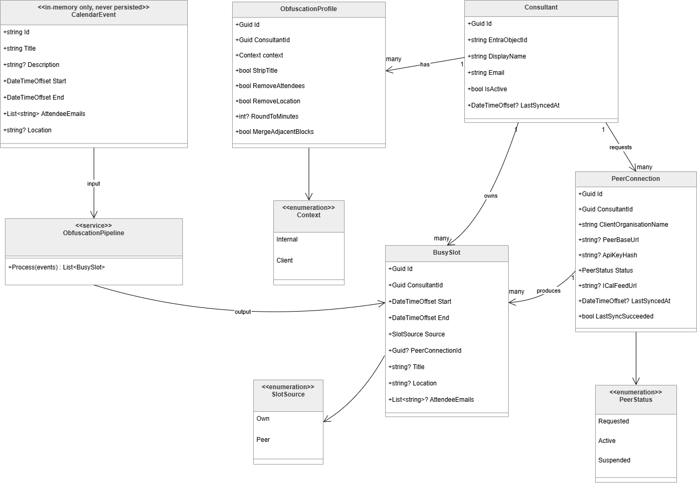

# 5. Building Block View

## Level 1: Solution Projects

The solution is structured as four .NET projects with a strict dependency hierarchy.

```
ObfusCal.Api
├── ObfusCal.Core        (domain models, interfaces, pipeline)
├── ObfusCal.Infrastructure  (calendar adapters, storage, peer client)
└── ObfusCal.Sync        (background sync service)
     └── ObfusCal.Core
```

`ObfusCal.Core` has no outward dependencies. `ObfusCal.Infrastructure` and `ObfusCal.Sync` depend only on
`ObfusCal.Core`. `ObfusCal.Api` wires everything together via dependency injection.

## Level 2: Key Components

### ObfusCal.Core

| Component             | Responsibility                                                           |
|-----------------------|--------------------------------------------------------------------------|
| `ICalendarSource`     | Contract that all calendar adapters must implement                       |
| `IEventTransformer`   | Contract for a single obfuscation step in the pipeline                   |
| `ObfuscationPipeline` | Chains transformers in sequence; converts `CalendarEvent` → `BusySlot`   |
| `IShadowSlotStore`    | Contract for storing busy slots received from peer instances             |
| `CalendarEvent`       | In-memory domain model for a raw calendar event (never persisted)        |
| `BusySlot`            | Persisted domain model representing an obfuscated time block             |
| `PeerConnection`      | Represents a trusted relationship with an external domain instance       |
| `ObfuscationProfile`  | Holds a user's obfuscation rule settings per context (internal / client) |

### ObfusCal.Infrastructure

| Component                 | Responsibility                                                                 |
|---------------------------|--------------------------------------------------------------------------------|
| `MockCalendarSource`      | Development adapter returning hardcoded events                                 |
| `GraphCalendarSource`     | Production adapter fetching events from Microsoft 365 via MS Graph             |
| `ICalFeedCalendarSource`  | Fallback adapter parsing a read-only `.ics` URL                                |
| `HttpPeerClient`          | Sends and receives obfuscated slots to/from peer instances over HTTPS          |
| `InMemoryShadowSlotStore` | Thread-safe in-memory store for received peer slots (PoC phase)                |
| `EfCoreShadowSlotStore`   | Persistent store backed by PostgreSQL via Entity Framework Core (later sprint) |

### ObfusCal.Sync

| Component     | Responsibility                                                                               |
|---------------|----------------------------------------------------------------------------------------------|
| `SyncService` | `BackgroundService` that runs the calendar fetch → obfuscate → push/pull cycle on a schedule |

### ObfusCal.Api

| Component               | Responsibility                                                                                               |
|-------------------------|--------------------------------------------------------------------------------------------------------------|
| `BusySlotsController`   | Exposes `GET /api/users/{id}/busy-slots` for peer instances to pull obfuscated slots                         |
| `ShadowSlotsController` | Exposes `POST /api/users/{id}/shadow-slots` for peer instances to push their slots                           |
| `FreeBusyController`    | Exposes `GET /api/users/{id}/free-busy` returning the merged availability view                               |
| `PluginLoader`          | Scans `plugins/` at startup and registers discovered `ICalendarSource` / `IEventTransformer` implementations |

## Domain Model


