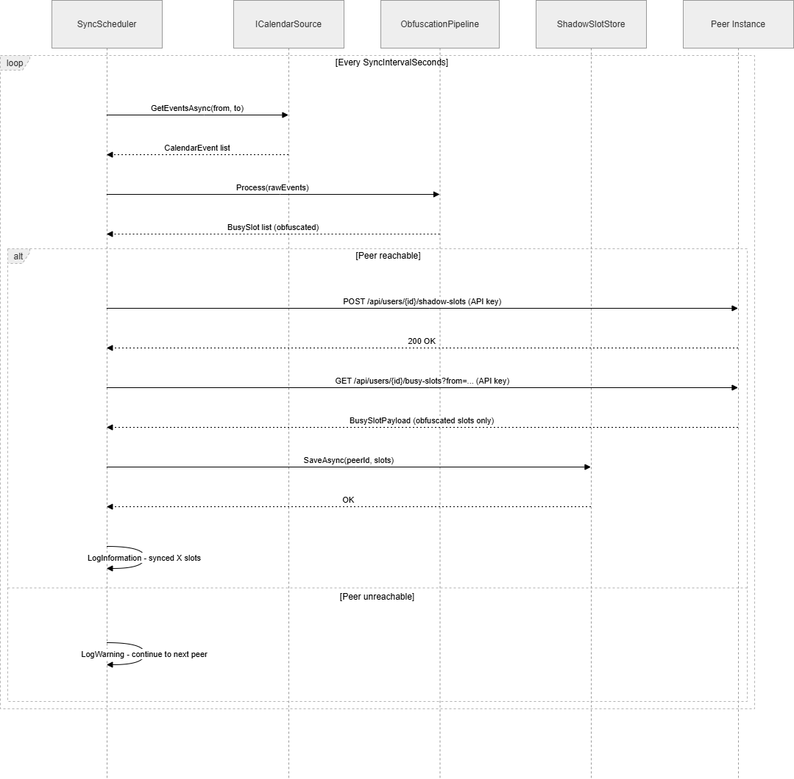

# 6. Runtime View

## Scenario 1: Background Sync Cycle

This is the primary runtime scenario. The `SyncService` runs on a configurable interval (default: 15 minutes).

**Narrative:**

1. The background scheduler wakes up and iterates over all active peer connections.
2. For each connection, it fetches the user's raw events from the calendar source (MS Graph, iCal, etc.).
3. The raw `CalendarEvent` objects are passed to `ObfuscationPipeline.Process()`, which applies the user's active
   `ObfuscationProfile` and returns a list of `BusySlot` objects.
4. The raw events immediately fall out of scope and are garbage collected. They are never written to disk.
5. The obfuscated `BusySlot` list is POSTed to the peer instance's `/api/shadow-slots` endpoint (push).
6. The system GETs the peer instance's `/api/busy-slots` endpoint to retrieve the remote slots (pull).
7. The received shadow slots are saved to the local `IShadowSlotStore`.
8. If a peer is unreachable, the failure is logged and that peer is skipped. Other peers are unaffected.

## Scenario 2: Peer Instance Pulls Busy Slots

An external peer instance requests the obfuscated slots for a specific user.

1. Peer sends `GET /api/users/{id}/busy-slots?from=...&to=...` with a valid API key in the `Authorization` header.
2. The API validates the API key against the configured peer connections.
3. The calendar source is queried for events in the requested window.
4. Events are passed through the obfuscation pipeline.
5. The resulting `BusySlot` list (containing only `start` and `end`) is returned as JSON.
6. No raw event data is included in the response at any point.

## Scenario 3: User Authenticates and Views Availability

1. User navigates to the ObfusCal web UI.
2. The application redirects to Info Support's Entra ID login page via OpenID Connect.
3. After successful authentication (including MFA), Entra ID returns a JWT token.
4. The application extracts the user's Object ID from the token and scopes all subsequent data access to that ID.
5. The user can view their merged free/busy view, which combines their own obfuscated slots with any shadow slots
   received from peer instances.

## Scenario 4: Asymmetric Sync (No Peer Instance)

This scenario occurs when a client organization does not run an ObfusCal peer instance.

1. The consultant provides a read-only .ics sharing link from their client-side calendar (e.g., Outlook Web).
2. During the background sync cycle, the ICalFeedCalendarSource fetches and parses this feed into raw CalendarEvent objects.
3. The events are passed through the obfuscation pipeline, producing obfuscated BusySlot data.
4. The resulting slots are stored locally as ShadowSlots in the IShadowSlotStore.
5. Since no peer instance is available, the system does not attempt to push BusySlots via a REST API.
6. Client contacts access availability through the consultant’s booking link or a generated .ics subscription.
7. When accessed, the system queries local data, merges internal commitments with stored shadow slots, and renders a unified free/busy view.