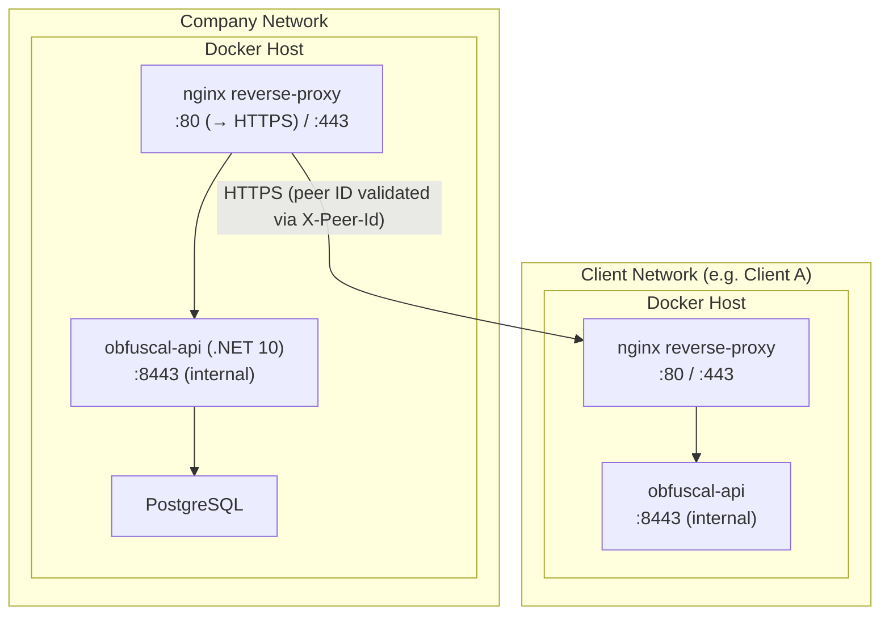

# 7. Deployment View

## Infrastructure

Each participating organisation deploys a single Docker container running the ObfusCal API. There is no shared
infrastructure between organisations.

Peer-to-peer traffic is sent directly to each peer's HTTPS endpoint. The application enforces `https://` peer base
URLs, rejects private-network targets, validates upstream certificates by default, and can optionally present a client
certificate for mTLS groundwork.



## Deployment Steps

Before starting the containers:

1. Ensure certificates exist under `certs/nginx` and `certs/api` (see `certs/README.md`).
2. Create a `.env` file from `.env.example` with PostgreSQL, API certificate, and application secret placeholders.
3. Decide how peer transport should be handled in the current environment:
   - **Production / staging:** keep `PeerTransportSecurity__AllowSelfSignedCerts=false` and use CA-issued peer certs.
   - **Development / local compose:** set `PeerTransportSecurity__AllowSelfSignedCerts=true` so self-signed peer
     certificates are accepted.
   - **Optional pinning:** populate `PeerConnections.PinnedCertificateThumbprint` for each peer if you want the peer
     TLS certificate to be fixed to a known leaf certificate.
   - **Optional mTLS groundwork:** store `PeerConnections.ClientCertificateThumbprint` for peers that should present a
     client certificate, and make sure the certificate is available in the local machine/user certificate store.
4. Ensure the Entra ID app role `Sysadmin` exists on the API app registration and is assigned to designated
   administrators.

Bring up a full instance (reverse proxy + API + PostgreSQL):

```bash
# Docker
docker compose up -d --build

# Podman
podman compose up -d --build
```

The `docker-compose.yaml` at the repository root wires the API to PostgreSQL and waits for a healthy DB before starting
the API container.

The API container remains single-purpose for the API process. Runtime still depends on external infrastructure
(PostgreSQL, TLS key material, and environment-provided secrets).

Peer sync traffic is additionally throttled in-process: authenticated peers are rate limited by peer ID, unauthenticated
API calls fall back to an IP-based backstop, and peer sync request bodies are capped at 1 MB by default.

For local API-only debugging, start PostgreSQL first and then run `dotnet run --project ObfusCal.Api` outside
containers.

## Environment Variables

| Variable                                              | Purpose                                                                                        |
|-------------------------------------------------------|------------------------------------------------------------------------------------------------|
| `ASPNETCORE_ENVIRONMENT`                              | Set to `Development` for Swagger UI; `Production` for live deployments                         |
| `ASPNETCORE_URLS`                                     | Kestrel listen URL inside the container (e.g. `https://+:8443`)                                |
| `ASPNETCORE_Kestrel__Certificates__Default__Path`     | Path to the PFX certificate file mounted into the container                                    |
| `ASPNETCORE_Kestrel__Certificates__Default__Password` | Password for the PFX certificate (sourced from `.env`)                                         |
| `API_CERT_PASSWORD`                                   | Passed to `docker compose` via `.env`; sets the Kestrel cert password                          |
| `DATAPROTECTION_KEYS_PATH`                            | Path where DataProtection keys are persisted (default: `/dataprotection/keys`)                 |
| `PeerConnections.ApiKeyHash` (database)               | Salted PBKDF2-SHA256 hash of peer API keys used by peer authentication                         |
| `PeerConnections.Scopes` (database)                   | Space-separated peer scopes (`push_shadow_slots`, `pull_busy_slots`)                           |
| `PeerConnections.RevokedAt` (database)                | Revocation timestamp; non-null peers are rejected by peer authentication                       |
| `ConnectionStrings__DefaultConnection`                | PostgreSQL connection string (required at startup)                                             |
| `AzureAd__TenantId`                                   | Entra tenant ID (required at startup)                                                          |
| `AzureAd__ClientId`                                   | Entra app/client ID (required at startup)                                                      |
| `GraphConsent__ClientId`                              | Microsoft Graph consent client ID (required at startup)                                        |
| `GraphConsent__ClientSecret`                          | Microsoft Graph consent client secret (optional depending on tenant app registration)          |
| `GoogleConsent__RedirectUri`                          | Optional Google OAuth callback override; must exactly match the URI registered in Google Cloud |
| `Sync__InstanceId`                                    | Local instance identifier used in peer sync headers                                            |
| `Sync__ApiKey`                                        | Shared API key used for peer sync authentication                                               |
| `Sync__PeerRequestTimestampToleranceSeconds`          | Replay window tolerance for `X-Peer-Timestamp` (default `300`)                                 |
| `Sync__PeerRequestRateLimitPermitLimit`               | Global peer/IP backstop request limit for API traffic (default `240` per `60` seconds)         |
| `Sync__PeerRequestRateLimitWindowSeconds`              | Window for the peer/IP backstop (default `60`)                                                 |
| `Sync__PushShadowSlotsRateLimitPermitLimit`            | Per-peer limit for `POST /api/shadow-slots` (default `60` per `60` seconds)                    |
| `Sync__PushShadowSlotsRateLimitWindowSeconds`          | Window for `POST /api/shadow-slots` rate limiting (default `60`)                               |
| `Sync__PullBusySlotsRateLimitPermitLimit`              | Per-peer limit for `GET /api/sync/busy-slots/{calendarOwnerRef}` (default `120` per `60` s)    |
| `Sync__PullBusySlotsRateLimitWindowSeconds`            | Window for `GET /api/sync/busy-slots/{calendarOwnerRef}` rate limiting (default `60`)          |
| `Sync__MaxRequestBodySizeBytes`                        | Maximum API request body size (default `1048576` bytes)                                        |
| `Sync__SyncIntervalSeconds`                           | How often the background sync runs (default: `900` = 15 minutes)                               |
| `Sync__MaxQueryWindowDays`                            | Maximum allowed inbound query window in days for busy/free-busy endpoints (default `90`)       |
| `Sync__MaxShadowSlotsPerRequest`                      | Maximum allowed shadow slots in one push payload (default `500`)                               |
| `PeerTransportSecurity__AllowSelfSignedCerts`         | Accept self-signed peer certificates when `true` (default `false`)                             |
| `PeerConnections.PinnedCertificateThumbprint`         | Optional peer leaf certificate thumbprint used to pin the expected server certificate           |
| `PeerConnections.ClientCertificateThumbprint`         | Optional peer client certificate thumbprint used as mTLS groundwork                             |
| `Secrets__Provider`                                   | Secret provider mode (`Environment` default, `External` stub)                                  |

At startup, ObfusCal validates required secrets and fails fast with a descriptive error when one is missing.

For Google Calendar OAuth in local development, prefer `https://localhost/consent-callback` or another public HTTPS
callback URI that is registered on the Google OAuth client. Google rejects `.local` redirect domains such as
`https://obfuscal.local/consent-callback`.

### DataProtection Key Persistence

**IMPORTANT:** The API uses Microsoft's Data Protection API (DPAPI) to encrypt sensitive credentials (OAuth tokens,
iCloud passwords). These encrypted values cannot be decrypted without the encryption keys.

To avoid losing credentials on container restart:

- Mount a persistent volume to `/dataprotection/keys` in the container (already configured in `docker-compose.yaml`)
- Ensure the mounted directory is readable and writable by the container process
- Do **not** share DataProtection keys between different API instances — each instance must have its own isolated key
  store

If DataProtection keys are lost, all encrypted credentials become unreadable and must be re-entered by the user.

See the `Dockerfile` and `docker-compose.yaml` for the volume configuration.

## CI/CD

Every push to `main` on GitHub triggers a GitHub Actions workflow that:

1. Runs `dotnet build` and `dotnet test`
2. Builds the Docker image using the multi-stage `Dockerfile`
3. Pushes the image to GitHub Container Registry (GHCR) tagged with `latest` and the commit SHA

Deploying an update on a running server:

```bash
docker pull ghcr.io/infsupstagemg/obfuscal-api:latest
docker compose up -d --build
```

## PoC vs Production Differences

| Concern | PoC                                                       | Production                                           |
|---------|-----------------------------------------------------------|------------------------------------------------------|
| Storage | In-memory shadow-slot store                               | PostgreSQL via EF Core                               |
| TLS     | Terminated at nginx sidecar (self-signed)                 | Terminated at reverse proxy with valid cert          |
| Auth    | API key + scope + timestamp replay checks + Entra ID OIDC | Strong peer auth + Entra ID OIDC                     |
| Secrets | `ISecretProvider` using env/config placeholders           | `ISecretProvider` with external secret store backend |

### Peer transport security operations checklist

- Ensure every peer base URL is `https://`.
- Keep `PeerTransportSecurity__AllowSelfSignedCerts=false` in production.
- Use `PeerConnections.PinnedCertificateThumbprint` if you need to fail closed on certificate rotation.
- Use `PeerConnections.ClientCertificateThumbprint` only when the remote peer is ready for mTLS.
- Remember that the client certificate must be installed on the host running ObfusCal; the application only selects it
  by thumbprint.
- If you are fronting ObfusCal with nginx or another reverse proxy, ensure it forwards `X-Forwarded-Proto` so the API
  can apply HTTPS redirection without looping.

