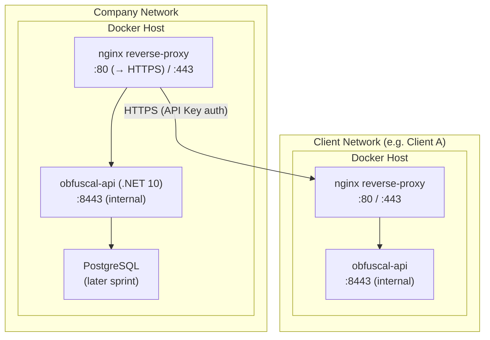

# 7. Deployment View

## Infrastructure

Each participating organisation deploys a single Docker container running the ObfusCal API. There is no shared
infrastructure between organisations.



## Deployment Steps

A new instance is brought up with:

```bash
docker compose up -d
```

The `docker-compose.yaml` at the repository root configures the required environment variables and port mapping.

## Environment Variables

| Variable                                              | Purpose                                                                |
|-------------------------------------------------------|------------------------------------------------------------------------|
| `ASPNETCORE_ENVIRONMENT`                              | Set to `Development` for Swagger UI; `Production` for live deployments |
| `ASPNETCORE_URLS`                                     | Kestrel listen URL inside the container (e.g. `https://+:8443`)        |
| `ASPNETCORE_Kestrel__Certificates__Default__Path`     | Path to the PFX certificate file mounted into the container            |
| `ASPNETCORE_Kestrel__Certificates__Default__Password` | Password for the PFX certificate (sourced from `.env`)                 |
| `API_CERT_PASSWORD`                                   | Passed to `docker compose` via `.env`; sets the Kestrel cert password  |
| `Sync__KnownPeerIds__0`, `__1`, …                     | Comma-indexed list of peer IDs accepted by `ShadowSlotsController`     |
| `ConnectionStrings__Default`                          | PostgreSQL connection string (later sprint)                            |
| `Sync__IntervalSeconds`                               | How often the background sync runs (default: `900` = 15 minutes)       |

## CI/CD

Every push to `main` on GitHub triggers a GitHub Actions workflow that:

1. Runs `dotnet build` and `dotnet test`
2. Builds the Docker image using the multi-stage `Dockerfile`
3. Pushes the image to GitHub Container Registry (GHCR) tagged with `latest` and the commit SHA

Deploying an update on a running server:

```bash
docker pull ghcr.io/infsupstagemg/obfuscal-api:latest
docker compose up -d
```

## PoC vs Production Differences

| Concern | PoC                                       | Production                                  |
|---------|-------------------------------------------|---------------------------------------------|
| Storage | In-memory                                 | PostgreSQL via EF Core                      |
| TLS     | Terminated at nginx sidecar (self-signed) | Terminated at reverse proxy with valid cert |
| Auth    | API key header (peer-to-peer)             | API key + Entra ID OIDC (human users)       |
| Secrets | Environment variables / `.env` file       | Secrets manager or Docker secrets           |
