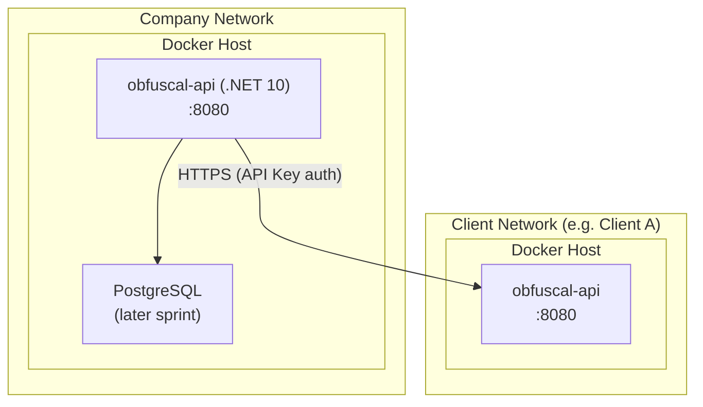

# 7. Deployment View

## Infrastructure

Each participating organisation deploys a single Docker container running the ObfusCal API. There is no shared
infrastructure between organisations.



## Deployment Steps

A new instance is brought up with:

```bash
docker compose up -d
```

The `docker-compose.yaml` at the repository root configures the required environment variables and port mapping.

## Environment Variables

| Variable                     | Purpose                                                                |
|------------------------------|------------------------------------------------------------------------|
| `ASPNETCORE_ENVIRONMENT`     | Set to `Development` for Swagger UI; `Production` for live deployments |
| `ASPNETCORE_HTTP_PORTS`      | Port the API listens on inside the container (default: `8080`)         |
| `ConnectionStrings__Default` | PostgreSQL connection string (later sprint)                            |
| `Sync__IntervalSeconds`      | How often the background sync runs (default: `900` = 15 minutes)       |

## CI/CD

Every push to `main` on GitHub triggers a GitHub Actions workflow that:

1. Runs `dotnet build` and `dotnet test`
2. Builds the Docker image using the multi-stage `Dockerfile`
3. Pushes the image to GitHub Container Registry (GHCR) tagged with `latest` and the commit SHA

Deploying an update on a running server:

```bash
docker pull ghcr.io/infsupstagemg/obfuscal-api:latest
docker compose up -d
```

## PoC vs Production Differences

| Concern | PoC                           | Production                                    |
|---------|-------------------------------|-----------------------------------------------|
| Storage | In-memory                     | PostgreSQL via EF Core                        |
| TLS     | Not handled by container      | Terminated at reverse proxy (nginx / Traefik) |
| Auth    | API key header (peer-to-peer) | API key + Entra ID OIDC (human users)         |
| Secrets | Environment variables         | Secrets manager or Docker secrets             |
