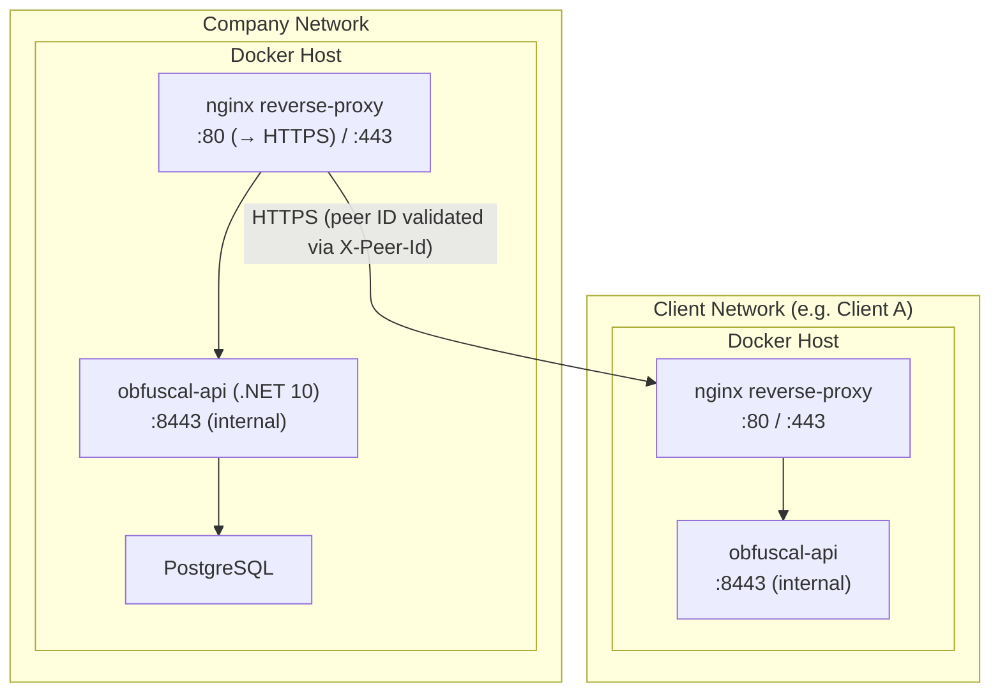

# 7. Deployment View

## Infrastructure

Each participating organisation deploys a single Docker container running the ObfusCal API. There is no shared
infrastructure between organisations.



## Deployment Steps

Before starting the containers:

1. Ensure certificates exist under `certs/nginx` and `certs/api` (see `certs/README.md`).
2. Create a `.env` file from `.env.example` with PostgreSQL and API certificate values.

Bring up a full instance (reverse proxy + API + PostgreSQL):

```bash
# Docker
docker compose up -d --build

# Podman
podman compose up -d --build
```

The `docker-compose.yaml` at the repository root wires the API to PostgreSQL and waits for a healthy DB before starting the API container.

For local API-only debugging, start PostgreSQL first and then run `dotnet run --project ObfusCal.Api` outside containers.

## Environment Variables

| Variable                                              | Purpose                                                                |
|-------------------------------------------------------|------------------------------------------------------------------------|
| `ASPNETCORE_ENVIRONMENT`                              | Set to `Development` for Swagger UI; `Production` for live deployments |
| `ASPNETCORE_URLS`                                     | Kestrel listen URL inside the container (e.g. `https://+:8443`)        |
| `ASPNETCORE_Kestrel__Certificates__Default__Path`     | Path to the PFX certificate file mounted into the container            |
| `ASPNETCORE_Kestrel__Certificates__Default__Password` | Password for the PFX certificate (sourced from `.env`)                 |
| `API_CERT_PASSWORD`                                   | Passed to `docker compose` via `.env`; sets the Kestrel cert password  |
| `PeerConnections.ApiKeyHash` (database)               | Hashed peer API keys used by peer authentication (`Authorization: ApiKey <key>`) |
| `ConnectionStrings__DefaultConnection`                | PostgreSQL connection string                                            |
| `Sync__IntervalSeconds`                               | How often the background sync runs (default: `900` = 15 minutes)       |

## CI/CD

Every push to `main` on GitHub triggers a GitHub Actions workflow that:

1. Runs `dotnet build` and `dotnet test`
2. Builds the Docker image using the multi-stage `Dockerfile`
3. Pushes the image to GitHub Container Registry (GHCR) tagged with `latest` and the commit SHA

Deploying an update on a running server:

```bash
docker pull ghcr.io/infsupstagemg/obfuscal-api:latest
docker compose up -d --build
```

## PoC vs Production Differences

| Concern | PoC                                       | Production                                  |
|---------|-------------------------------------------|---------------------------------------------|
| Storage | In-memory shadow-slot store               | PostgreSQL via EF Core                      |
| TLS     | Terminated at nginx sidecar (self-signed) | Terminated at reverse proxy with valid cert |
| Auth    | Known-peer ID header + Entra ID OIDC      | Strong peer auth (planned) + Entra ID OIDC  |
| Secrets | Environment variables / `.env` file       | Secrets manager or Docker secrets           |
