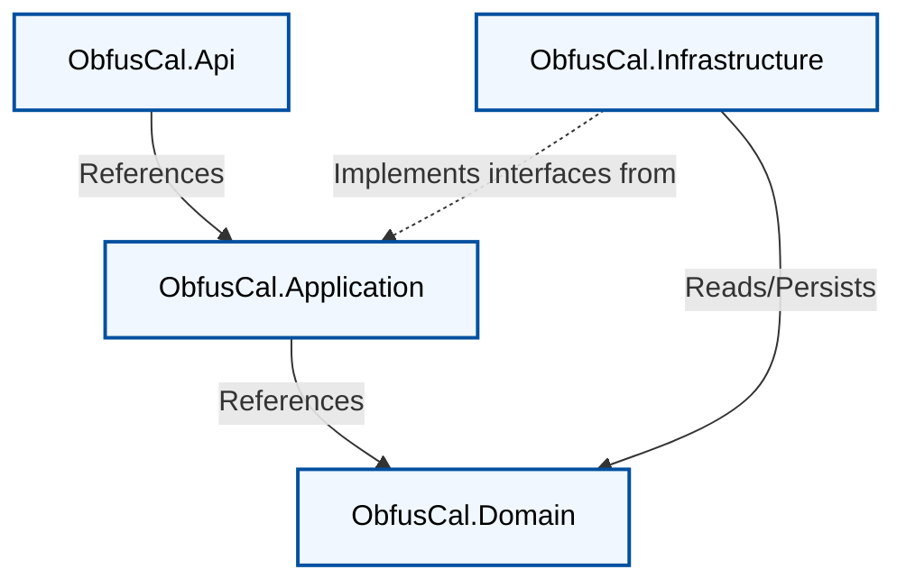

# Clean Architecture - Project Structure & Rules

This document defines the architectural conventions for this codebase. It is intended for both human developers and AI
assistants working on the project. All contributions must adhere to these rules.

> This is a **target architecture guide** for ObfusCal. Some examples describe the desired end state, not the current
> implementation.

---

## Overview

This project follows **Clean Architecture** as described by Robert C. Martin. The core principle is the **Dependency
Rule**:

> Source code dependencies may only point **inward**. An inner layer must never reference anything from an outer layer.

The architecture is divided into four layers, each with a strict and well-defined responsibility:



---

## Project Layout

Target structure:

```
src/
├── ObfusCal.Domain/
├── ObfusCal.Application/
├── ObfusCal.Infrastructure/
└── ObfusCal.Api/

tests/
├── ObfusCal.Domain.Tests/
├── ObfusCal.Application.Tests/
└── ObfusCal.Integration.Tests/
```

Current repository projects are `ObfusCal.Domain`, `ObfusCal.Application`, `ObfusCal.Infrastructure`, `ObfusCal.Api`,
`ObfusCal.Plugins.GoogleCalendar`, `ObfusCal.Plugins.ICloudCalendar`, and `ObfusCal.Tests`.

---

## Layer Reference

### 1. Domain - `ObfusCal.Domain`

**The innermost layer. Contains all enterprise business rules.**

#### Rules

- Has **zero external NuGet dependencies**. Only the .NET BCL is allowed.
- Contains no references to any other project in the solution.
- All business logic that is intrinsic to the domain (invariants, rules, state transitions) lives here and nowhere else.
- Never references EF Core, ASP.NET, or any framework.

#### Allowed contents

- **Entities / aggregates** - e.g., `CalendarOwner`, `SyncPeer`, `ShadowSlotBatch`.
- **Value objects** - e.g., `BusyWindow`, `CalendarOwnerId`, `PeerId`.
- **Domain events** - e.g., `BusySlotsObfuscatedEvent`, `ShadowSlotsPushedEvent`.
- **Domain errors** - typed constants like `CalendarOwnerErrors.InvalidRange`.
- **Common base types** - `Entity<TId>`, `AggregateRoot<TId>`, `ValueObject`, `DomainEvent`, `Result<T>`, `Error`.

#### Folder structure

<!-- START_TREE path="ObfusCal.Domain" max_depth="2" -->
```text
ObfusCal.Domain/
├── Models/
│   ├── BusySlot.cs
│   └── CalendarEvent.cs
├── Obfuscation/
│   ├── Transformers/
│   ├── IBusySlotTransformer.cs
│   ├── IObfuscationTransformer.cs
│   └── ITransformerPlugin.cs
└── ObfusCal.Domain.csproj
```
<!-- END_TREE -->

#### Key patterns

**Domain models are lightweight immutable records — no inheritance, no framework dependencies:**

<!-- START_SNIPPET path="ObfusCal.Domain/Models/CalendarEvent.cs" -->
```cs
namespace ObfusCal.Domain.Models;

public record CalendarEvent(
    string Id,
    string Title,
    string? Description,
    DateTimeOffset Start,
    DateTimeOffset End,
    IReadOnlyList<string> AttendeeEmails,
    string? Location
);
```
<!-- END_SNIPPET -->

<!-- START_SNIPPET path="ObfusCal.Domain/Models/BusySlot.cs" -->
```cs
namespace ObfusCal.Domain.Models;

public record BusySlot(
    string SourceEventId,
    DateTimeOffset Start,
    DateTimeOffset End,
    string? Title = null,
    string? Description = null,
    IReadOnlyList<string>? AttendeeEmails = null,
    string? Location = null,
    IReadOnlyList<BusySlot>? SourceSlots = null
);
```
<!-- END_SNIPPET -->

**Obfuscation contracts are defined in Domain — declared here, implemented in Infrastructure or loaded as plugins:**

<!-- START_SNIPPET path="ObfusCal.Domain/Obfuscation/IObfuscationTransformer.cs" -->
```cs
using ObfusCal.Domain.Models;

namespace ObfusCal.Domain.Obfuscation;

public interface IObfuscationTransformer
{
    CalendarEvent Transform(CalendarEvent calendarEvent);
}
```
<!-- END_SNIPPET -->

---

### 2. Application - `ObfusCal.Application`

**Orchestrates domain objects to fulfill use cases. Contains no business logic of its own.**

#### Rules

- References only `ObfusCal.Domain`. Never references `Infrastructure` or `Api`.
- Defines **interfaces** for external dependencies (calendar providers, storage, clock, peer directory).
- Organizes use cases using **CQRS**: commands mutate state, queries read state.
- Contains pipeline behaviors for validation/logging/transactions.
- Uses explicit hand-written mappings (no AutoMapper).

#### Allowed contents

- **Commands and command handlers** - e.g., push incoming shadow slots.
- **Queries and query handlers** - e.g., get merged free/busy view.
- **Validators** - one per command/query.
- **Response DTOs** returned to presentation.
- **Repository and service interfaces** - e.g., `IShadowSlotStore`, `ICalendarSource`.
- **Pipeline behaviors** - `ValidationBehavior`, `LoggingBehavior`, `TransactionBehavior`.
- **Domain event handlers**.

#### Forbidden contents

- EF Core, SQL, or persistence implementation details.
- Direct HTTP clients or SDK usage.
- References to `Infrastructure` or `Api` projects.

#### Folder structure

<!-- START_TREE path="ObfusCal.Application" max_depth="2" -->
```text
ObfusCal.Application/
├── Configuration/
│   ├── CalendarSourceOptions.cs
│   ├── GoogleConsentOptions.cs
│   ├── GraphConsentOptions.cs
│   ├── ICloudCalendarOptions.cs
│   ├── PeerTransportSecurityOptions.cs
│   ├── PluginAllowlistOptions.cs
│   ├── SecretKeys.cs
│   ├── SecretProviderOptions.cs
│   ├── SecretValidationOptions.cs
│   ├── SecurityAuditOptions.cs
│   └── SyncOptions.cs
├── Interfaces/
│   ├── GraphConsentAccessLevel.cs
│   ├── ICalendarOwnerAvailabilitySlotStore.cs
│   ├── ICalendarOwnerAvailabilitySyncService.cs
│   ├── ICalendarOwnerClientBusySlotService.cs
│   ├── ICalendarOwnerGoogleConsentService.cs
│   ├── ICalendarOwnerGraphConsentService.cs
│   ├── ICalendarOwnerICloudConfigurationService.cs
│   ├── ICalendarOwnerIcalFeedService.cs
│   ├── ICalendarOwnerObfuscationProfileService.cs
│   ├── ICalendarOwnerProvisioningService.cs
│   ├── ICalendarOwnerScopeResolver.cs
│   ├── ICalendarOwnerService.cs
│   ├── ICalendarSource.cs
│   ├── ICalendarSourceInstances.cs
│   ├── ICalendarSourcePlugin.cs
│   ├── ICalendarWriteBack.cs
│   ├── IColumnEncryptor.cs
│   ├── IGoogleOAuthTokenClient.cs
│   ├── IGraphOAuthTokenClient.cs
│   ├── IInboundPeerPullSyncService.cs
│   ├── ILogRedactor.cs
│   ├── IOutboundPeerSyncService.cs
│   ├── IPeerApiKeyAuthenticator.cs
│   ├── IPeerCalendarOwnerResolver.cs
│   ├── IPeerConnectionService.cs
│   ├── IPluginAllowlistAdminService.cs
│   ├── ISecretProvider.cs
│   ├── ISecurityAuditService.cs
│   ├── IShadowSlotStore.cs
│   ├── IStatusService.cs
│   ├── ISyncRuntimeOptionsProvider.cs
│   ├── IUrlSafetyValidator.cs
│   └── PeerApiScopes.cs
├── Obfuscation/
│   ├── ObfuscationAuditContext.cs
│   ├── ObfuscationPipeline.cs
│   └── ObfuscationProfileSettings.cs
├── UseCases/
│   ├── GetBusySlots/
│   ├── GetMergedFreeBusy/
│   ├── PushShadowSlots/
│   └── Validation/
├── DependencyInjection.cs
├── ObfusCal.Application.csproj
└── PluginDiscovery.cs
```
<!-- END_TREE -->

#### Key patterns

**Use cases are declared as interfaces in Application — controllers and callers depend only on the interface:**

```csharp
public interface IGetMergedFreeBusyUseCase
{
    Task<IReadOnlyList<MergedFreeBusyResponse>> ExecuteAsync(
        GetMergedFreeBusyQuery query, CancellationToken ct);
}
```

**Implementations inject only Application-layer abstractions and orchestrate work without business logic:**

```csharp
public sealed class GetMergedFreeBusyUseCase(
    ICalendarSourceResolver calendarSourceResolver,
    ObfuscationPipeline obfuscationPipeline,
    IShadowSlotStore shadowSlotStore,
    ICalendarOwnerObfuscationProfileService obfuscationProfileService)
    : IGetMergedFreeBusyUseCase
{
    public async Task<IReadOnlyList<MergedFreeBusyResponse>> ExecuteAsync(
        GetMergedFreeBusyQuery query, CancellationToken ct)
    {
        var calendarSource = await calendarSourceResolver.ResolveAsync(query.CalendarOwnerId, ct);
        var events = await calendarSource.GetEventsAsync(query.From, query.To, query.CalendarOwnerId, ct);
        var profile = await obfuscationProfileService.GetProfileAsync(
            query.CalendarOwnerId, ObfuscationAuditContext.Internal, ct);
        var own = obfuscationPipeline.Process(
            events, query.CalendarOwnerId.ToString(), ObfuscationAuditContext.Internal, profile);
        var shadow = await shadowSlotStore.GetAllSlotsAsync(
            query.CalendarOwnerId, query.From, query.To, ct);

        return own.Concat(shadow).OrderBy(s => s.Start)
            .Select(s => new MergedFreeBusyResponse(s.Start, s.End, s.Title, s.Description,
                s.AttendeeEmails, s.Location, s.SourceSlots))
            .ToList();
    }
}
```

**Interfaces belong to Application, implementation belongs to Infrastructure:**

<!-- START_SNIPPET path="ObfusCal.Application/Interfaces/IShadowSlotStore.cs" -->
```cs
using ObfusCal.Domain.Models;

namespace ObfusCal.Application.Interfaces;

public interface IShadowSlotStore
{
    Task SetSlotsAsync(string peerId, IReadOnlyList<BusySlot> slots, CancellationToken ct = default);
    Task SetSlotsAsync(string peerId, Guid calendarOwnerId, IReadOnlyList<BusySlot> slots, CancellationToken ct = default);
    Task<IReadOnlyList<BusySlot>> GetSlotsAsync(string peerId, CancellationToken ct = default);
    Task<IReadOnlyList<BusySlot>> GetSlotsAsync(string peerId, Guid calendarOwnerId, CancellationToken ct = default);
    Task<IReadOnlyList<BusySlot>> GetAllSlotsAsync(
        DateTimeOffset from, DateTimeOffset to, CancellationToken ct = default);
    Task<IReadOnlyList<BusySlot>> GetAllSlotsAsync(
        Guid calendarOwnerId,
        DateTimeOffset from,
        DateTimeOffset to,
        CancellationToken ct = default);
}
```
<!-- END_SNIPPET -->

---

### 3. Infrastructure - `ObfusCal.Infrastructure`

**Implements all interfaces defined in Application. Contains all framework and I/O concerns.**

#### Rules

- References both `ObfusCal.Domain` and `ObfusCal.Application`.
- Is not referenced from feature code in `ObfusCal.Api`; wiring happens at composition root (`Program.cs`).
- Classes in this layer primarily exist to implement Application abstractions.
- EF Core configuration, migrations, and persistence logic live here.
- External service clients (calendar APIs, HTTP peers, storage) live here.

#### Allowed contents

- **DbContext** and EF Core mappings.
- **Migrations**.
- **Repository/storage implementations**.
- **Unit of Work implementation**.
- **External service adapters** (calendar providers, peer clients).
- **Domain event dispatcher**.
- **`DependencyInjection.cs`** extension method (target end state).

#### Forbidden contents

- Business logic.
- Direct references to `ObfusCal.Api` feature code.
- Use-case orchestration.

#### Folder structure

<!-- START_TREE path="ObfusCal.Infrastructure" max_depth="2" -->
```text
ObfusCal.Infrastructure/
├── Calendars/
│   ├── AggregateCalendarSource.cs
│   ├── CalendarOwnerCalendarSourceService.cs
│   ├── CalendarSourceInstanceService.cs
│   ├── CalendarSourcePluginCatalog.cs
│   ├── CalendarSourceResolver.cs
│   ├── EfCorePeerCalendarOwnerResolver.cs
│   ├── EfCorePluginAllowlistAdminService.cs
│   ├── GoogleCalendarSourceCore.WriteBack.cs
│   ├── GoogleCalendarSourceCore.cs
│   ├── GoogleOAuthTokenClient.cs
│   ├── GraphCalendarSource.Models.cs
│   ├── GraphCalendarSource.WriteBack.cs
│   ├── GraphCalendarSource.cs
│   ├── GraphOAuthTokenClient.cs
│   ├── ICalFeedCalendarSource.cs
│   ├── ICloudCalendarSourceCore.WriteBack.cs
│   ├── ICloudCalendarSourceCore.cs
│   ├── IcsCalendarEventParser.cs
│   ├── MockCalendarSource.cs
│   └── PluginAllowlistCache.cs
├── Persistence/
│   ├── AppDbContext.cs
│   ├── AppDbContextFactory.cs
│   ├── BusySlot.cs
│   ├── CalendarOwner.cs
│   ├── CalendarOwnerAvailabilitySlot.cs
│   ├── CalendarOwnerGoogleConsentService.cs
│   ├── CalendarOwnerGraphConsentService.cs
│   ├── CalendarOwnerICalFeed.cs
│   ├── CalendarOwnerICloudConfigurationService.cs
│   ├── CalendarOwnerIcalFeedService.cs
│   ├── CalendarOwnerObfuscationProfileService.cs
│   ├── CalendarOwnerPeerMapping.cs
│   ├── CalendarOwnerProvisioningService.cs
│   ├── CalendarOwnerService.cs
│   ├── CalendarSourceInstance.cs
│   ├── EfCoreCalendarOwnerScopeResolver.cs
│   ├── EncryptedStringConverter.cs
│   ├── ObfuscationProfile.cs
│   ├── PeerConnection.cs
│   ├── PeerConnectionService.cs
│   ├── PluginAllowlistOverride.cs
│   └── StatusService.cs
├── Security/
│   ├── AesGcmColumnEncryptor.cs
│   ├── CalendarSourceSecretProtector.cs
│   ├── ConfiguredSecretProvider.cs
│   ├── DefaultLogRedactor.cs
│   ├── EfCorePeerApiKeyAuthenticator.cs
│   ├── EnvironmentSecretProvider.cs
│   ├── ExternalSecretProvider.cs
│   ├── FileSecurityAuditService.cs
│   ├── PassthroughColumnEncryptor.cs
│   ├── PeerApiKeySecurity.cs
│   ├── PeerTransportSecurity.cs
│   ├── SecretStartupValidator.cs
│   ├── SyncRuntimeOptionsProvider.cs
│   └── UrlSafetyValidator.cs
├── Storage/
│   ├── EfCoreCalendarOwnerAvailabilitySlotStore.cs
│   ├── EfCoreShadowSlotStore.cs
│   └── InMemoryShadowSlotStore.cs
├── Sync/
│   ├── CalendarOwnerAvailabilityBackgroundService.cs
│   ├── CalendarOwnerAvailabilitySyncService.cs
│   ├── CalendarOwnerClientBusySlotService.cs
│   ├── InboundPeerPullSyncService.cs
│   ├── OutboundPeerSyncService.cs
│   ├── PeerSyncBackgroundService.cs
│   └── ShadowSlotRetentionBackgroundService.cs
├── DependencyInjection.cs
└── ObfusCal.Infrastructure.csproj
```
<!-- END_TREE -->

#### Key patterns

**Implement interfaces from Application/Core contracts only:**

```csharp
internal sealed class EfCoreShadowSlotStore(AppDbContext dbContext) : IShadowSlotStore
{
    public async Task SetSlotsAsync(string peerId, IReadOnlyList<BusySlot> slots, CancellationToken ct = default)
    {
        var existing = await dbContext.ShadowSlots.Where(s => s.PeerId == peerId).ToListAsync(ct);
        dbContext.ShadowSlots.RemoveRange(existing);
        dbContext.ShadowSlots.AddRange(slots.Select(s => ShadowSlotEntity.FromDomain(peerId, s)));
        await dbContext.SaveChangesAsync(ct);
    }
}
```

**Centralize registrations in one extension method (target):**

```csharp
public static class DependencyInjection
{
    public static IServiceCollection AddInfrastructure(this IServiceCollection services, IConfiguration config)
    {
        services.AddDbContext<AppDbContext>(options =>
            options.UseNpgsql(config.GetConnectionString("DefaultConnection")));

        services.AddScoped<IShadowSlotStore, EfCoreShadowSlotStore>();
        services.AddScoped<ICalendarSource, MockCalendarSource>();
        return services;
    }
}
```

---

### 4. Presentation - `ObfusCal.Api`

**The entry point of the application. Translates HTTP to application commands/queries and back.**

#### Rules

- References only `ObfusCal.Application` in the target architecture.
- The composition root (`Program.cs`) is the place where Application and Infrastructure meet.
- Controllers/endpoints are thin: receive input, dispatch command/query, translate result.
- Validation is handled in Application via pipeline behaviors.

#### Allowed contents

- Controllers or Minimal APIs.
- Middleware (exception handling, request logging, correlation IDs).
- `Program.cs` composition root.
- Result-to-ProblemDetails mapping extensions.

#### Forbidden contents

- Business logic.
- Direct database access.
- Domain entity construction in controllers.
- Direct use of infrastructure implementations (`EfCoreShadowSlotStore`, `AppDbContext`, etc.).

#### Folder structure

<!-- START_TREE path="ObfusCal.Api" max_depth="2" -->
```text
ObfusCal.Api/
├── Authentication/
│   ├── PeerApiAuthorizationPolicies.cs
│   ├── PeerApiKeyAuthenticationDefaults.cs
│   ├── PeerApiKeyAuthenticationHandler.cs
│   └── PeerApiKeyClaimTypes.cs
├── Authorization/
│   ├── AppAuthorizationPolicies.cs
│   ├── CalendarOwnerAccessEvaluator.cs
│   ├── CurrentUserContextAccessor.cs
│   └── UserIdentityExtensions.cs
├── Components/
│   ├── Layout/
│   ├── Pages/
│   ├── Shared/
│   ├── App.razor
│   ├── App.razor.cs
│   ├── Routes.razor
│   └── _Imports.razor
├── Controllers/
│   ├── AccountController.cs
│   ├── AdminPeerConnectionsController.cs
│   ├── AdminPluginAllowlistController.cs
│   ├── CalendarConsentServices.cs
│   ├── CalendarOwnerGoogleConsentController.cs
│   ├── CalendarOwnerObfuscationProfilesController.cs
│   ├── CalendarOwnersController.cs
│   ├── PeerConnectionsController.cs
│   ├── PeerSyncController.cs
│   ├── ShadowSlotsController.cs
│   ├── StatusController.cs
│   └── SyncController.cs
├── Properties/
│   └── launchSettings.json
├── RateLimiting/
│   ├── ApiRequestRateLimitEnforcer.cs
│   ├── PeerRateLimitIdentityCapture.cs
│   ├── PeerRateLimiting.cs
│   ├── RateLimitBucketEvictionService.cs
│   ├── RateLimitRejectionHandler.cs
│   ├── RateLimitStore.cs
│   ├── RateLimitSubjectResolver.cs
│   └── RateLimitingContextKeys.cs
├── wwwroot/
│   ├── css/
│   ├── js/
│   └── favicon.png
├── DotEnvLoader.cs
├── ObfusCal.Api.csproj
├── ObfusCal.Api.http
├── Program.cs
├── ProgramSetup.cs
├── SecurityHeadersMiddleware.cs
├── appsettings.Development.json
└── appsettings.json
```
<!-- END_TREE -->

#### Key patterns

**Controllers are delivery mechanisms only — inject use case interfaces, never infrastructure implementations:**

```csharp
[ApiController]
[Authorize]
[Route("api/calendar-owners")]
public sealed class CalendarOwnersController(
    IGetBusySlotsUseCase getBusySlotsUseCase,
    IGetMergedFreeBusyUseCase getMergedFreeBusyUseCase,
    CalendarOwnerAccessEvaluator accessEvaluator) : ControllerBase
{
    [HttpGet("{id}/busy-slots")]
    public async Task<IActionResult> GetBusySlots(
        string id, [FromQuery] DateTimeOffset from, [FromQuery] DateTimeOffset to, CancellationToken ct)
    {
        await accessEvaluator.AssertOwnerAccessAsync(id, User, ct);
        var result = await getBusySlotsUseCase.ExecuteAsync(new GetBusySlotsQuery(id, from, to), ct);
        return Ok(result);
    }
}
```

**Composition root wires all layers:**

```csharp
builder.Services
    .AddInfrastructure(builder.Configuration)  // DbContext, stores, adapters, plugin loading
    .AddApplication();                          // Use cases, obfuscation pipeline
```

---

## Dependency Graph

The arrows represent "references / depends on":

```
ObfusCal.Api
    │
    └──► ObfusCal.Application
                │
                └──► ObfusCal.Domain

ObfusCal.Infrastructure
    │
    ├──► ObfusCal.Application   (implements interfaces defined here)
    └──► ObfusCal.Domain        (persists and reads entities/value objects)
```

`ObfusCal.Api` and `ObfusCal.Infrastructure` should not depend on each other's feature code. They connect at runtime
through DI.

---

## Cross-Cutting Concerns

### Error Handling

Validation failures are communicated via `RequestValidationException` thrown by use-case code, caught by global
exception middleware, and mapped to `400 ValidationProblemDetails`. Unexpected failures (DB unreachable, calendar
API errors) propagate as exceptions and are returned as `500` problem details without stack traces or internal detail.

- Domain is free of error types — it defines records and interfaces only.
- Use cases surface input-validation failures via `RequestValidationException`.
- The API maps these to RFC 9457 problem detail responses (`ValidationProblemDetails` or `ProblemDetails`).
- Unhandled exceptions are caught by the ASP.NET Core exception handler middleware.

### Validation

- Use cases validate inputs at the start of `ExecuteAsync` and throw `RequestValidationException` for constraint
  violations (window too large, slot end before start, etc.).
- DataAnnotations on controller request DTOs are checked by the ASP.NET Core model binder before the action runs,
  returning `400 ValidationProblemDetails` automatically.

### Domain Events

- Aggregates raise events like `BusySlotsObfuscatedEvent`.
- Events are dispatched after persistence succeeds.
- Event handlers live in Application and handle side effects (notifications, read-model updates, telemetry).

### Transactions

- `TransactionBehavior<TRequest, TResponse>` wraps commands in a transaction.
- Queries do not run inside write transactions.
- Handlers do not begin transactions manually.

---

## Testing Strategy

Each layer should have a dedicated test project and strategy.

| Layer       | Test project                 | Strategy                                                                   |
|-------------|------------------------------|----------------------------------------------------------------------------|
| Domain      | `ObfusCal.Domain.Tests`      | Pure unit tests for invariants and value objects.                          |
| Application | `ObfusCal.Application.Tests` | Unit tests with mocked interfaces (`ICalendarSource`, `IShadowSlotStore`). |
| Integration | `ObfusCal.Integration.Tests` | End-to-end HTTP tests via `WebApplicationFactory<Program>`.                |

Current state: tests are centralized in `ObfusCal.Tests`. Split by layer incrementally while preserving coverage.

---

## NuGet Package Ownership by Layer

| Package                                               | Allowed in     |
|-------------------------------------------------------|----------------|
| *(none)*                                              | Domain         |
| Microsoft.Extensions.DependencyInjection.Abstractions | Application    |
| Entity Framework Core                                 | Infrastructure |
| Npgsql.EntityFrameworkCore.PostgreSQL                 | Infrastructure |
| Serilog                                               | Infrastructure |
| Calendar provider SDKs / HTTP clients                 | Infrastructure |
| Microsoft.AspNetCore                                  | Api            |
| Swashbuckle                                           | Api            |

If you want to add a NuGet package to `ObfusCal.Domain`, stop and reconsider first.

---

## Rules Summary

| Rule                                                 | Detail                                                                                       |
|------------------------------------------------------|----------------------------------------------------------------------------------------------|
| **Dependency direction**                             | Always inward. Never outward.                                                                |
| **Domain has no dependencies**                       | Zero external NuGet packages. Zero project references.                                       |
| **Interfaces in Application**                        | Repository/service interfaces are defined in `Application`, implemented in `Infrastructure`. |
| **Infrastructure not used directly in Api features** | They meet at the composition root in `Program.cs`.                                           |
| **No logic in controllers**                          | Controllers dispatch commands/queries and map results.                                       |
| **No business logic in Application**                 | Handlers orchestrate; domain rules stay in domain.                                           |
| **No persistence in Application**                    | Handlers call abstractions, never EF/SQL directly.                                           |
| **Result pattern, not exceptions**                   | Business rule violations return `Result.Failure(error)`.                                     |
| **One handler per use case**                         | Every command/query has one handler.                                                         |
| **Validators in Application**                        | One validator per command/query, executed via pipeline.                                      |
