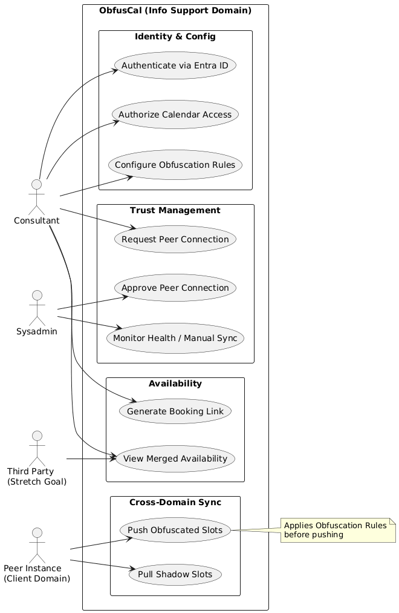

# Welcome to ObfusCal

ObfusCal is a self-hosted, open-source web application that eliminates scheduling conflicts by synchronizing
availability information across calendar environments and domain boundaries, **without exposing sensitive
calendar data**.

## The Problem

Software consultants at Info Support frequently work across multiple client engagements simultaneously.
A consultant's work calendar at a client site, their Info Support calendar, and their personal calendars
all exist in separate silos. When a meeting invitation arrives in one calendar, there is no automated way
to verify whether that time is already claimed somewhere else.

## The Solution

Each organization runs their own instance of ObfusCal within their own network. Instances exchange only
obfuscated busy slots over a secured API. No raw event data ever crosses a domain boundary. The obfuscated
slots are written directly into each connected calendar so that everyone's availability is visible from
within their existing calendar client.

## System Use Cases

{ width="600" }

Read more about our [Federated Architecture](adr/0001-federated-architecture.md)